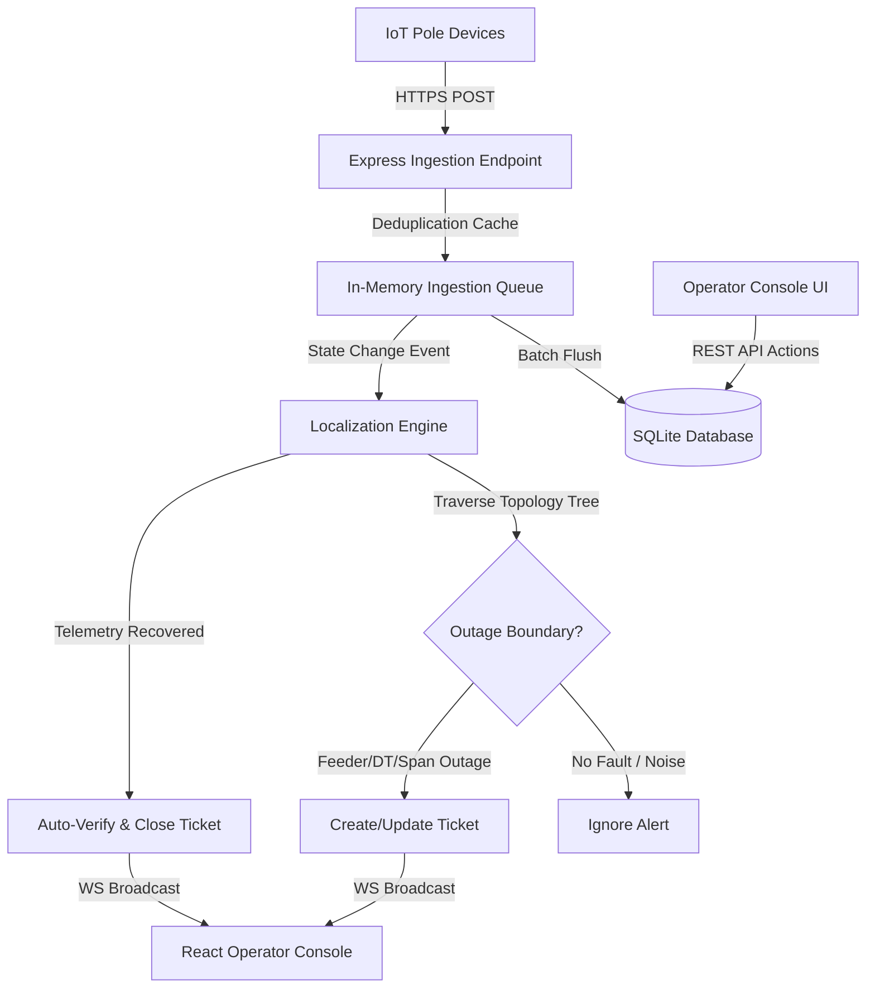

# System Architecture - KSPDB Fault Localization

This document details the engineering architecture, algorithms, and design choices of the KSPDB Outage Localization system.

---

## 1. System Overview & Data Flow

The system operates as a reactive event pipeline. Telemetry events flow from IoT devices to the API, update the dynamic cache and database, trigger the localization engine, and broadcast state changes in real-time to the operator screen via WebSockets.

---

## 2. Telemetry Ingestion & Deduplication

To meet the target of $\ge 500$ msg/s sustained and $5,000$ msg burst capacity:
* **Deduplication:** An in-memory cache tracks `(device_id, seq)` pairs. If an incoming sequence is less than or equal to the cached sequence, it is discarded immediately without querying SQLite.
* **Batch Logging:** Telemetry logs are pushed to an in-memory queue and flushed in bulk transactions to the `telemetry_logs` table every 500ms, minimizing database lock contention.
* **State Cache:** The current energized status of poles is updated directly in the `devices` table and cached in memory for rapid localization traversal.

---

## 3. SQLite Schema & Internal Models

We use a relational schema in SQLite. Key tables are:
1. `feeders`: Defines the transmission lines feeding transformers.
2. `transformers`: Defines substation-connected distribution points.
3. `poles`: Represents nodes in the distribution tree. Stores static relationships (`parent_pole_id`) and dynamic device IDs.
4. `devices`: Tracks active states (`energized`), capacitor level (`battery_mv`), RSSI, and firmware.
5. `tickets`: Tracks incident status (`detected` $\rightarrow$ `acknowledged` $\rightarrow$ `crew_assigned` $\rightarrow$ `resolved` $\rightarrow$ `verified` $\rightarrow$ `closed`), severity, and coordinates.

---

## 4. Fault Localization & Topology Reconstruction

### The 60% Missing Topology Reconstruction (MST)
For distribution transformers lacking pole-ordering documentation, the system executes **Prim's Algorithm for Minimum Spanning Trees (MST)** at startup:
1. It forms a coordinate graph containing the DT (root) and all poles assigned to it.
2. The weight of edges between nodes is the physical distance between coordinates.
3. Prim's algorithm connects all nodes, minimizing the total line length. Because LT distribution networks are designed to minimize cabling length while remaining radial (tree-shaped), the MST is a highly reliable geometric approximation.
4. Spans created this way are flagged as `inferred = true` in memory.

### The Boundary Localization Algorithm
When telemetry updates, the engine traverses the tree starting from the DT root:
1. **Feeder Outages:** If all poles under every DT on a feeder are dark, it's flagged as a Feeder Outage.
2. **DT Outages:** If all device-fitted poles under a DT are dark, it's flagged as a DT Outage.
3. **Span Outages:** For partial DT darkness, it runs a tree traversal. An edge `P_parent -> P_child` represents the break boundary if `P_parent` is live (or is the DT) and `P_child` is dark/offline.
4. **Gaps (9% unmetered poles):** If `P_child` is unmetered, it traverses further downstream until it hits a dark device-fitted pole. The fault is localized as a span range (`P_parent -> ... -> P_dark`) and confidence is reduced.

---

## 5. Noise Handling & "Don't Cry Wolf"

* **Sensor Watchdog:** Heartbeats occur every 15 minutes. If a device fails to report for $>16.5$ minutes, it is flagged as `offline`.
* **Sensor Malfunction vs Outage:** If a device is dark/offline, but its downstream children report `energized = 1`, the localization engine flags it as a `sensor_malfunction` and suppresses ticket creation.
* **Scheduled Maintenance Suppression:** The system queries the `/scheduled-outages` feed. If an outage is detected during a maintenance window (plus 30 minutes before and 60 minutes after), automatic ticketing is suppressed.

---

## 6. Real-Time Telemetry Verification

Resolving tickets is controlled by telemetry, not user claims:
1. When a technician resolves a ticket, the backend checks all downstream devices.
2. If any device is still reporting `energized = false` or has timed out, the endpoint returns `400 Bad Request` and blocks the resolution.
3. If they are all energized, the ticket moves to `verified` and `closed`.
4. If telemetry returns on its own (repair completed), the engine auto-verifies and auto-closes the ticket.

---

## 7. REST & WebSocket API Surface

| Method | Endpoint | Description |
|--------|----------|-------------|
| `POST` | `/api/telemetry` | Ingests telemetry packets from devices. |
| `GET` | `/api/tickets` | Returns all active and historical tickets. |
| `POST` | `/api/tickets/:id/acknowledge` | Moves ticket status to acknowledged. |
| `POST` | `/api/tickets/:id/assign` | Assigns crew to ticket. |
| `POST` | `/api/tickets/:id/resolve` | Triggers telemetry check and closes if successful. |
| `GET` | `/api/network` | Returns full network topology, node states, and MST lines. |
| `GET` | `/api/scheduled-outages` | Retrieves active scheduled maintenance window. |
| `POST` | `/api/scheduled-outages` | Injects new scheduled outage (simulator tool). |
| `POST` | `/api/ai/chat` | Chat endpoint for the Operator Co-Pilot. |

---

## 8. UI Design & AI Co-Pilot

* **Interactive SCADA Canvas:** We implemented an SVG-based interactive canvas for panned/zoomed network rendering. Inferred spans are visually dashed, and faulty spans glow red, making navigation simple.
* **AI Operator Assistant:** Integrates Gemini API (falling back to a structured mock without keys) to parse grid context, active outages, and ticket reports, giving the 2 a.m. operator plain-English summaries and actions.
